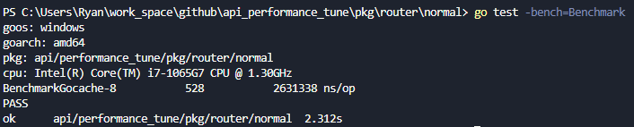
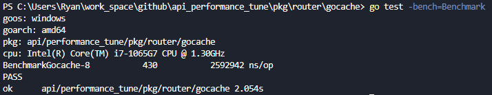
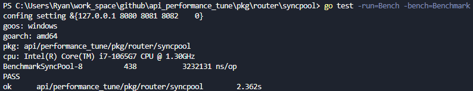

# api_performance_tune
 ```
 API優化測試
 ```

### 1.modidfy : cmd >>  config
### 2.run : cmd 

----

## 一般map存取
api_performance_tune\pkg\router\normal\normal_test.go

cmd >> go test -bench=.



## 使用cache
api_performance_tune\pkg\router\gocache\gocache_test.go

cmd >> go test -bench=.




## 使用sync.Pool
api_performance_tune\pkg\router\syncpool\api_gocache_test.go

cmd >> go test -bench=.


